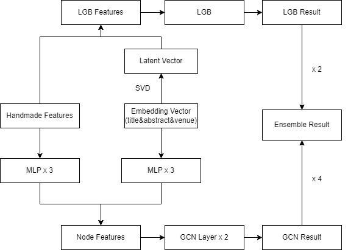

## Architecture


## Prerequisites
- Linux
- Python 3.10.12
- PyTorch 2.2.0.dev20231107+cu121

## Getting Started

### Clone this repo

```bash
git clone https://github.com/LoveFishoO/2024-KDD-WhoIsWho.git
cd 2024-KDD-WhoIsWho/
```

### Installation
```bash
pip install -r requirements.txt
```

## Run

### Encode
Inculde three embedding models
1.  ``multilingual-e5-large-instruct`` (title, abstruct, venue)
2. ``voyage-large-2-instruct`` (title, abstruct, venue)
3. ``bge-m3``(orgs)

```bash
python3 encode.py --api_key "The api key of voyageai"
```

### Run LGB & Save feature dataframe
```bash
cd LGB
```
For ``E5-Instruct``
```bash
python3 ./e5_instruct_lgb.py
```

For ``Voyage-Instruct``
```bash
python3 ./voyage_lgb.py
```

The path of feature data is in ``./out_data``

### Build Graph data
```bash
cd ..
cd GCN
```

For ``E5-Instruct embedding + E5-Instruct LGB features``

```bash
python3 ./GCN/build_graph.py \ 
    --title_embeddings_dir ../out_data/e5_instruct_title_data.pkl \
    --abstract_embeddings_dir ../out_data/e5_instruct_abstract_data.pkl \
    --venue_embeddings_dir ../out_data/e5_instruct_venue_data.pkl \
    --train_feats_dir ../out_data/e5_instruct_train.csv \
    --test_feats_dir ../out_data/e5_instruct_test.csv  \
    --save_train_dir ../out_data/e5_instruct_graph_train.pkl \
    --save_test_dir ../out_data/e5_instruct_graph_test.pkl
```
For ``E5-Instruct embedding + Voyage LGB features``

```bash
python3 ./GCN/build_graph.py \ 
    --title_embeddings_dir ../out_data/e5_instruct_title_data.pkl \
    --abstract_embeddings_dir ../out_data/e5_instruct_abstract_data.pkl \
    --venue_embeddings_dir ../out_data/e5_instruct_venue_data.pkl \
    --train_feats_dir ../out_data/voyage_train.csv \
    --test_feats_dir ../out_data/voyage_test.csv  \
    --save_train_dir ../out_data/e5_instruct_embed_voyage_feats_graph_train.pkl \
    --save_test_dir ../out_data/e5_instruct_embed_voyage_feats_graph_test.pkl
```
For ``Voyage embedding + Voyage LGB features``

```bash
python3 ./GCN/build_graph.py \ 
    --title_embeddings_dir ../out_data/voyage_title_data.pkl \
    --abstract_embeddings_dir ../out_data/voyage_abstract_data.pkl \
    --venue_embeddings_dir ../out_data/voyage_venue_data.pkl \
    --train_feats_dir ../out_data/voyage_train.csv \
    --test_feats_dir ../out_data/voyage_test.csv  \
    --save_train_dir ../out_data/voyage_graph_train.pkl \
    --save_test_dir ../out_data/voyage_graph_test.pkl
```

For ``Voyage embedding + E5-Instruct LGB features``

```bash
python3 ./GCN/build_graph.py \ 
    --title_embeddings_dir ../out_data/voyage_title_data.pkl \
    --abstract_embeddings_dir ../out_data/voyage_abstract_data.pkl \
    --venue_embeddings_dir ../out_data/voyage_venue_data.pkl \
    --train_feats_dir ../out_data/e5_instruct_train.csv \
    --test_feats_dir ../out_data/e5_instruct_test.csv  \
    --save_train_dir ../out_data/voyage_embed_e5_instruct_feats_graph_train.pkl \
    --save_test_dir ../out_data/voyage_embed_e5_instruct_feats_graph_test.pkl
```
### Run GCN
For ``E5-Instruct embedding + E5-Instruct LGB features``

```bash
python3 ./train.py \
    --train_dir ../out_data/e5_instruct_graph_train.pkl
    --test_dir ../out_data/e5_instruct_graph_test.pkl
    --save_result_dir ../output/e5_instruct_gcn.json
```

For  ``E5-Instruct embedding + Voyage LGB features``

```bash
python3 ./train.py \
    --train_dir ../out_data/e5_instruct_embed_voyage_feats_graph_train.pkl
    --test_dir ../out_data/e5_instruct_embed_voyage_feats_graph_test.pkl
    --save_result_dir ../output/e5_instruct_embed_voyage_feats_gcn.json
```
For ``Voyage embedding + Voyage LGB features``

```bash
python3 ./train.py \
    --train_dir ../out_data/voyage_graph_train.pkl
    --test_dir ../out_data/voyage_graph_test.pkl
    --save_result_dir ../output/voyage_gcn.json
```

For ``Voyage embedding + E5-Instruct LGB features``
```bash
python3 ./train.py \
    --train_dir ../out_data/voyage_embed_e5_instruct_feats_graph_train.pkl
    --test_dir ../out_data/voyage_embed_e5_instruct_feats_graph_test.pkl
    --save_result_dir ../output/voyage_embed_e5_instruct_feats_gcn.json
```

**Note: please use CPU to train model.**

### Essemble
```bash
cd ..
```

```bash
python3 ensemble.py
```


## Results on Test Set

### Single Model
| Method| AUC |
|-------|-------|
| LGB-E5 |0.81658|
| LGB-E5-Instruct |0.81709|
| LGB-Voyage |0.81433|

Note: 
* ``E5: multilingual-e5-large`` 
* ``E5-Instruct: multilingual-e5-large-instruct`` 
* ``Voyage: voyage-large-2-instruct``

